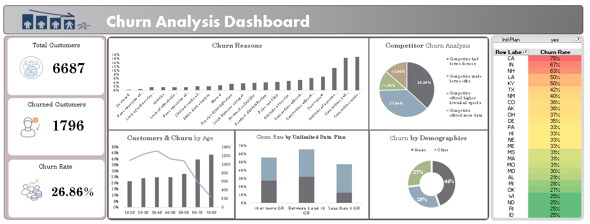

# 📉 Databel Telecom Churn Analysis

## 📌 Project Overview
This project focuses on identifying the key drivers behind customer attrition (churn) for **Databel**, a telecommunications provider. By analyzing a dataset of **6,687 customers**, the goal was to discover why customers leave and provide data-driven recommendations to improve retention.

## 📊 Visual Dashboard
Below is the comprehensive dashboard created to visualize churn trends, demographic impacts, and service usage patterns.

## ⚙️ Data Preparation & Pipeline
The project follows a rigorous data lifecycle:
- **Cleaning (`Databel - Customer WORKING.csv`)**: Handled missing values and standardized the `Churned` flag.
- **Feature Engineering**: Created custom age segments (Under 30, Senior, Other) and grouped data consumption into buckets (e.g., "Less than 5 GB", "10 or more GB").
- **Aggregation**: Summarized data to calculate churn rates across geographic locations (States) and contract types.

## 📈 Key Findings
- **Overall Churn Rate:** The current rate stands at **26.86%**.
- **The Age Factor:** Seniors (65+) have a much higher churn risk (**38.22%**) than younger demographics.
- **Contract Risk:** Month-to-month contracts are the primary source of churn compared to long-term commitments.
- **Main Reasons for Leaving:** Competitor offers, price points (extra data charges), and dissatisfaction with network reliability.

## 📁 Repository Structure
- `Data/`: Contains raw ("BEFORE") and processed ("WORKING") datasets.
- `Scripts/`: Analysis notes and pivot table configurations.
- `visuals/`: Contains the dashboard screenshots and charts.
- `README.md`: Project documentation.

## 🛠️ Tech Stack
- **Advanced Excel:** Pivot Tables, Data Formatting, and KPI Dashboarding.
- **Data Analysis:** Statistical summarization and trend identification.
